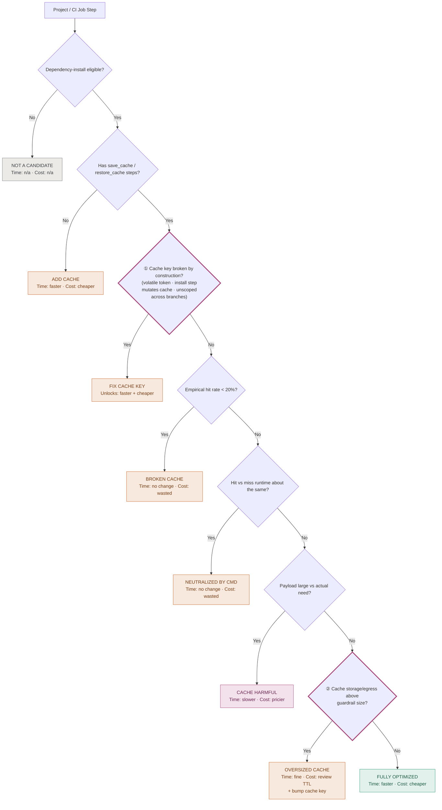

# Cache Optimization Candidate Tree — v2

Amended after validating the tree against 20+ real CircleCI runs in this repo.
Two leaves (marked ① ②) gained a diagnostic or a fix step the field test
showed was missing.

Each leaf: Time impact + Cost impact.

## Changelog

**① "Fix cache key" diagnostic expanded.** Previously only checked for a
volatile token (`.Revision`, timestamp). Two more root causes produce the
same broken-cache symptom without ever showing a volatile token: an install
command that mutates the restored files before `save_cache` runs (checksum
drifts between restore and save), and a cache key not scoped to the
branch/concurrency dimension, letting parallel runs race for the same cache
object.

Evidence: zod/npm — `npm install` rewrote `package-lock.json` in place,
permanently breaking the cache; separately, zod's unscoped key raced across
concurrent branches and failed to restore.

**② "Oversized cache" fix step added.** Shrinking the cached payload alone
doesn't shrink the cache — `save_cache` no-ops when a key already has a
saved archive, so a stale, oversized archive keeps getting restored forever
unless the key itself changes.

Evidence: hugo — the payload fix alone did nothing until the key was bumped
to `v2-`, which produced a fresh 232MiB archive (down from a stale 423MiB
one).
