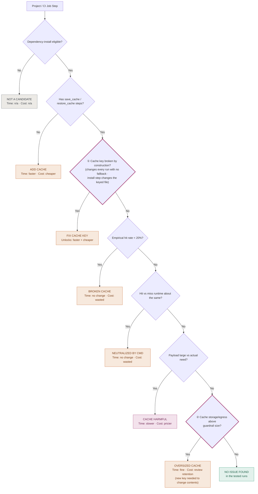

# Cache Optimization Candidate Tree (draft v2)

**Status: draft, will be replaced by a checklist.** A review found that some
steps in this tree are too simple:

- A key that changes every run is only broken when there is no stable
  fallback key. With a fallback key, it restores the most recent cache.
- The 20% hit rate limit has no evidence behind it. A low hit rate can still
  be worth it when each hit saves a lot of time.
- Many problems can happen at the same time, so a single path through a
  tree is not enough.
- The tree was written for jobs with hand-written cache steps. CircleCI
  functions (like `setup-go`) have no cache steps, so the second question
  does not fit them.

## Changes from v1

**① "Fix cache key" covers more cases.** v1 only checked for a key that
changes every run. We also found a second case: an install command that
changes the file used for the key. In rxjs, `npm install` rewrote
`package-lock.json`, so the saved key never matched the next restore.

An earlier version of this doc also listed "key not scoped by branch" as a
cause. We removed it because the evidence was not clear (see the zod note in
the README).

**② "Oversized cache" needs a new key to change.** `save_cache` skips a key
that already exists. So a change to what a cache saves only takes effect
with a new key. For hugo, the change worked only after we renamed the key to
`v2-`. A new key does not delete the old cache. It stays in storage until
the org's retention period ends.
